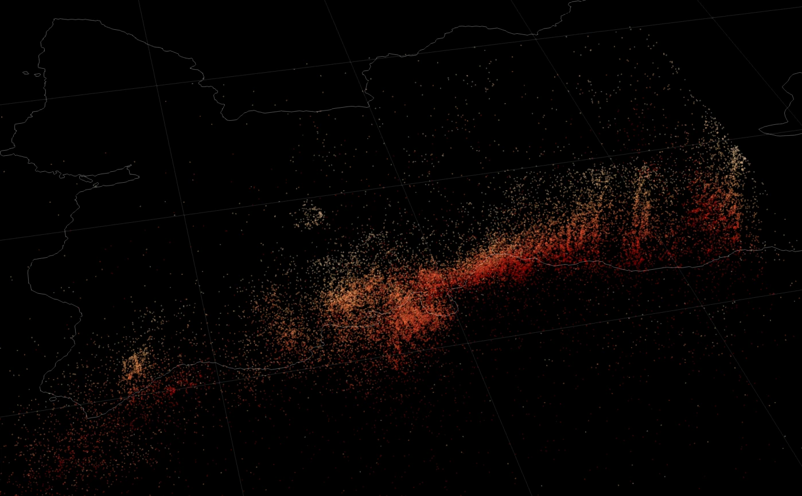

# Welcome to Qseek 🐕‍🦺

Qseek is an earthquake detection and localisation framework. It combines modern **machine learning phase detection and robust migration and stacking techniques**.

The detector is leveraging [Pyrocko](https://pyrocko.org) and [SeisBench](https://github.com/seisbench/seisbench), it is highly-performant and can search massive data sets for seismic activity efficiently.

!!! abstract "Citation"
    Marius Paul Isken, Peter Niemz, Jannes Münchmeyer, Sebastian Heimann, Simone Cesca, Torsten Dahm, Qseek: A data-driven Framework for Machine-Learning Earthquake Detection, Localization and Characterization, Seismica, 2024, *submitted*

*Seismic swarm activity at Iceland, Reykjanes Peninsula during a 2020 unrest. 15,000+ earthquakes detected, outlining a dike intrusion, preceeding the 2021 Fagradasfjall eruption. Visualized in [Pyrocko Sparrow](https://pyrocko.org).*

## Features

* [x] Earthquake phase detection using machine-learning pickers from [SeisBench](https://github.com/seisbench/seisbench)
* [x] Octree localisation approach for efficient and accurate search
* [x] Different velocity models:
    * [x] Constant velocity
    * [x] 1D Layered velocity model
    * [x] 3D fast-marching velocity model (NonLinLoc compatible)
* [x] Extraction of earthquake event features:
    * [x] Local magnitudes
    * [x] Ground motion attributes
* [x] Automatic extraction of modelled and picked travel times
* [x] Calculation and application of station corrections / station delay times
* [ ] Real-time analytics on streaming data (e.g. SeedLink)

[Get Started!](getting_started.md){ .md-button }

## Build with

{ width="100" }
{ width="400" padding-right="40" }
{ width="100" }
